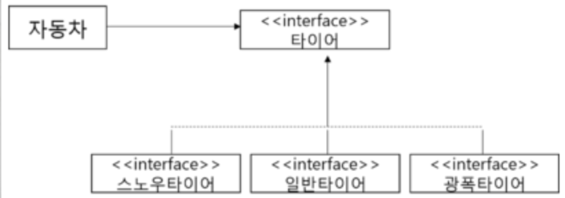

# 11장. DIP: 의존성 역전 원칙

## DIP란?
- 소스코드 의존성이 추상에 의존하며 구체에는 의존하지 않아야 시스템은 유연성이 높아진다. 
- DIP는 "고수준 모듈은 저수준 모듈의 구현에 의존해서는 안 된다. 저수준 모듈이 고수준 모듈에서 정의한 추상 타입에 의존해야 한다"를 의미한다. 
- 쉽게 말해서 "자신보다 변하기 쉬운 것에 의존하지 마라"
  
  

 

## DIP 지키기 위한 방법
#### 변동성이 큰 구체 클래스를 참조하지 말라.
- 대신 추상 인터페이스를 참조하자.
- 객체 생성은 추상 팩토리를 사용하여 해결 가능
> String 클래스 구체 클래스지만, 변경되는 일이 거의없이 안정적이여서 애써 추상클래스 안만듬
#### 변동성이 큰 구체 클래스로 부터 파생하지 말라.
- 상속은 신중하게 하자.
#### 구체 함수를 오버라이드 하지 마라.
- 구체 함수는 소스 코드 의존성을 필요로 한다.
- 따라서 구체 함수를 오버라이드 하면 이러한 의존성을 제거할 수 없게 되며, 그 의존성을 상속하게 된다.
- 의존성을 제거하려면 차라리 추상 함수로 선언하고, 구현체들에서 각자 용도에 맞게 구현하자.
#### 구체적이며 변동성이 크다면 절대로 그 이름을 언급하지 마라.

## Reference
- 클린아키텍처
- 개발자가 반드시 정복해야 할 객체 지향과 디자인 패턴 (최범균)
- https://steady-coding.tistory.com/388