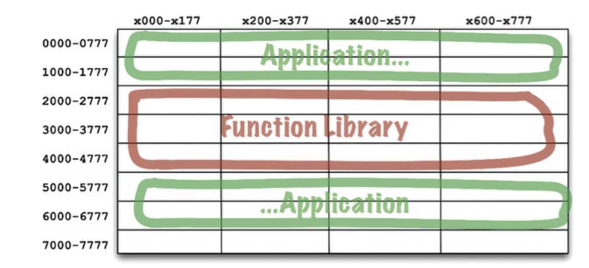
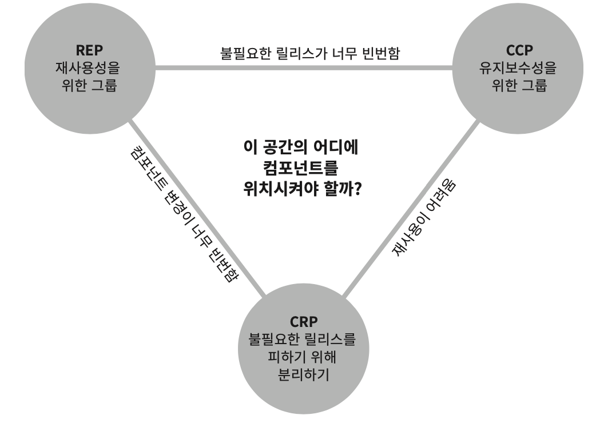

# 04부. 컴포넌트 원칙

- [04부. 컴포넌트 원칙](#04부-컴포넌트-원칙)
- [12장. 컴포넌트](#12장-컴포넌트)
  - [컴포넌트란?](#컴포넌트란)
  - [컴포넌트 역사](#컴포넌트-역사)
    - [구시대](#구시대)
    - [라이브러리 코드와 프로그램 코드 분리](#라이브러리-코드와-프로그램-코드-분리)
    - [재배치](#재배치)
    - [로드와 링크 분리](#로드와-링크-분리)
  - [결론](#결론)
- [13장. 컴포넌트 응집도](#13장-컴포넌트-응집도)
  - [REP: 재사용/릴리스 등가 원칙](#rep-재사용릴리스-등가-원칙)
  - [CCP: 공통 폐쇄 원칙](#ccp-공통-폐쇄-원칙)
      - [**SRP(단일책임원칙)**](#srp단일책임원칙)
      - [**OCP(개방폐쇄원칙)**](#ocp개방폐쇄원칙)
  - [CRP: 공통 재사용 원칙](#crp-공통-재사용-원칙)
  - [균형 다이어그램](#균형-다이어그램)
  - [Refrence](#refrence)

# 12장. 컴포넌트

## 컴포넌트란?
- 컴포넌트는 배포단위다. 즉 **시스템의 구성 요소로 배포할 수 있는 가장 작은 단위**다.
  - 자바로 치면 jar 파일이 컴포넌트

- 여러 컴포넌트를 서로 링크하여 실행 가능한 단일 파일(ex .war파일)로 생성할 수 있다.
- 잘 설계된 컴포넌트는 '독립적으로 배포와 개발'이 가능해야한다.

 

## 컴포넌트 역사

### 구시대
- 프로그래머가 메모리의 어느 위치에 로드할지 직접 정해야하고, **위치가 결정되면 재배치가 불가능**함.
- 라이브러리 함수 코드를 프로그램 코드에 직접 포함 시켜 컴파일했다. => **컴파일 느리고, 한정적인 메모리**

 

### 라이브러리 코드와 프로그램 코드 분리

  

- 컴파일 속도를 위하여 라이브러리 코드와 프로그램 코드 분리 => 개별 컴파일 및 특정 위치에 로드함. 
- but 코드가 커지면서 연속적으로 로드할 수 없어서 **단편화 문제** 발생

 

### 재배치

- 위의 문제를 해결하고자 **컴파일러는 메모리의 위치를 재배치할 수 있는 형태로 바이너리를 생성**할 수 있도록 수정하고, 이를 **로더를 사용해서 재배치**하는 것이다.
- 컴파일러는 애플리케이션에서 라이브러리 함수를 호출한다면 함수 이름은 **"외부 참조"로 생성**하고, 라이브러리 함수를 정의하는 프로그램이라면 해당 함수 이름은 **"외부정의"로 생성**
- **외부 정의를 로드할 위치가 정해지기만 하면 로더가 외부 참조를 외부정의에 링크시킬 수 있게되는데, 이게 바로 "링킹 로더"다.**

 

### 로드와 링크 분리

  

- 링킹 로더의 등장으로 프로그래머는 프로그램을 개별적으로 컴파일하고 로드할 수 있는 단위로 분할할 수 있게 되었다.
- 하지만 프로그램이 커지면서 => **링킹 로더가 너무 느려짐**
- 프로그래머가 느린 부분(링크 과정)을 맡았는데, 링커라는 별도의 애플리 케이션으로 이 작업을 처리하도록 만들었다.
  - 링커는 링크가 완료된 재배치 코드를 만듬
- 한번 만들어둔 실행 파일으로 로더의 로딩 과정이 아주 빨라짐.

 

## 결론
- 컴포넌트는 결국 런타임에 플러그인 형태로 결합할 수 있는 동적 링크파일을 말한다. (.jar 파일과 같이)

 

# 13장. 컴포넌트 응집도

- 어떤 클래스를 어느 컴포넌트에 포함시켜야할까? 컴포넌트 응집도에 관한 3가지 원칙이 있다.
 

## REP: 재사용/릴리스 등가 원칙

- **정의는 "재사용 단위는 릴리스 단위와 같다"라는 뜻이다.**
- 릴리스 번호가 있어야 재사용 컴포넌트가 서로 호환되는지 보증하고, 새로운 버전은 언제 출시되고 무엇이 변했는지 개발자들이 알 수 있다.
- 이 원칙을 아키텍처 관점에서 보면 단일 컴포넌트는 응집성 높은 클래스와 모듈들로 구성되야 함을 뜻한다. 
  - 즉 컴포넌트를 구성하는 모든 모듈은 서로 공유 하는 중요한 목적이 있어야한다.
- **하나의 컴포넌트로 묶인 클래스와 모듈은 반드시 함께 릴리스할 수 있어야한다.**
  - 버전 번호가 같아야하며, 동일한 릴리스로 추적 관리되야한다.

> - 응집도란?
>   - 응집도는 모듈에 포함된 내부 요소들이 연관돼 있는 정도를 나타낸다.
>   - 모듈 내의 요소들이 하나의 목적을 위해 긴밀하게 협력한다면 그 모듈은 높은 응집도를 가진다.
>   - 모듈 내의 요소들이 서로 다른 목적을 추구한다면 그 모듈은 낮은 응집도를 가진다.
>   - 객체지향 관점에서 응집도는 객체 또는 클래스에 얼마나 관련 높은 책임들을 할당했는지를 나타낸다.

 

## CCP: 공통 폐쇄 원칙

- **정의는 "동일한 이유로 동일한 시점에 변경되는 클래스를 같은 컴포넌트로 묶어라. 서로 다른 시점에 다른 이유로 변경되는 클래스는 다른 컴포넌트로 분리하라."이다.**
#### **SRP(단일책임원칙)** 
- CCP는 SRP을 컴포넌트 관점에서 쓴것이다. 
- 즉 단일 컴포넌트는 변경의 이유가 여러개 있어서는 안된다는 뜻이다.
-  코드가 변경이 된다면 여러 컴포넌트가 아닌 단일 컴포넌트에서만 발생하는 것이 해당 컴포넌트만 검증하고 재배포하면 되니깐 더 낫다. CCP는 서로 다른 이유로 변경되는 클래스를 서로 다른 컴포넌트로 묶어야한다. 
- 따라서 소프트웨어를 릴리스, 재검증, 배포하는 작업량 최소화가능하다.
#### **OCP(개방폐쇄원칙)**
- CCP에서는 동일한 유형의 변경에 대해 닫혀 있는 클래스들을 하나의 컴포넌트로 묶음으로써 OCP에서 얻은 교훈을 확대 적용한다. 따라서 변경이 발생했을때 영향 주는 컴포넌트들이 최소한으로 한정될 가능성이 높아진다.

 

## CRP: 공통 재사용 원칙 
- **정의는 "컴포넌트 사용자들을 필요하지 않는 것에 의존하게 강요하지 말라."이다.**
- 같이 재사용되며 상호작용하는 클래스와 모듈들은 같은 컴포넌트에 포함해야 한다.
- 동일한 컴포넌트 묶으면 안되는 경우
  - 사용하는 컴포넌트가 사용되는 컴포넌트의 극히 일부인 단 하나의 클래스만 사용해도 의존성이 생긴다. 따라서 사용되는 컴포넌트에서 발생한 변경이 사용하는 컴포넌트와 전혀 관련이 없어도 재컴파일, 재검증, 재배포 해야 하는 가능성이 있다.

> CRP는 사용하지 않는 메서드가 있는 클래스에 의존하지 말라는 인터페이스 분리 원칙(ISP)의 포괄적인 버전이다.
> 즉 **필요하지 않는 것에 의존하지 마라.**

 

## 균형 다이어그램
  

- 3가지 원칙은 서로 상충된다.
  - REP와 CCP는 포함원칙이며, 컴포넌트를 더욱 크게 만든다.
  - CRP는 배제 원칙이며, 컴포넌트를 더욱 작게 만든다.

 

## Refrence
- 응집도 정의 : https://velog.io/@ljinsk3/%EC%A2%8B%EC%9D%80-%EC%84%A4%EA%B3%84%EB%9E%80-feat.-%EA%B2%B0%ED%95%A9%EB%8F%84-%EC%9D%91%EC%A7%91%EB%8F%84