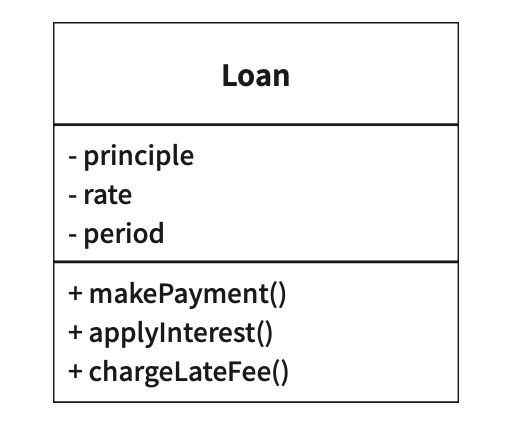
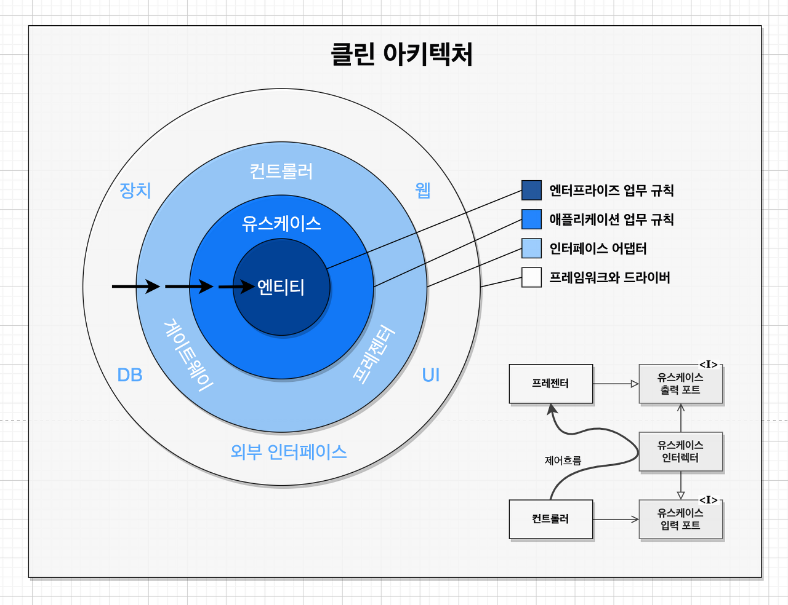
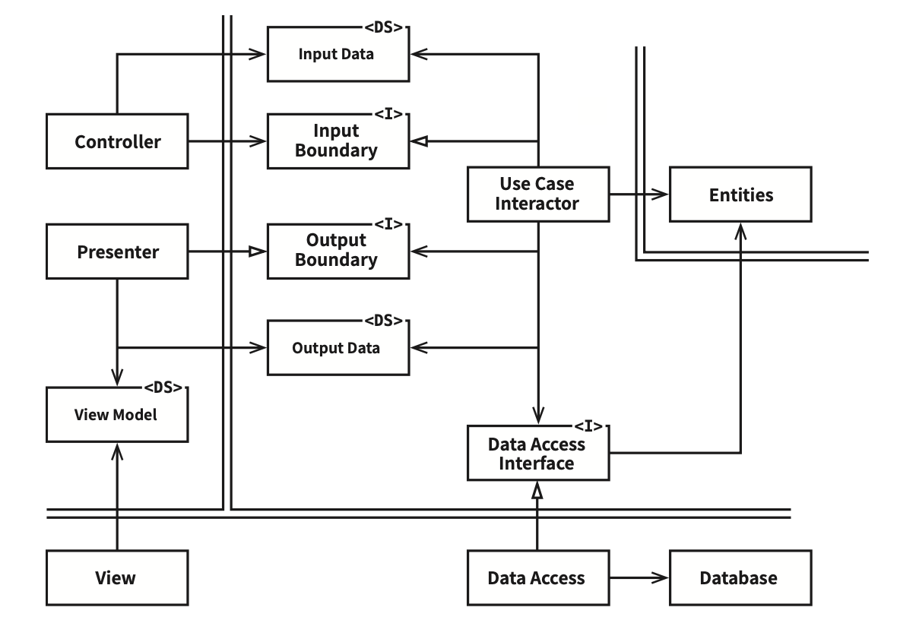

# 05-3부. 아키텍처

# 20장. 업무 규칙

## 용어 정의
> 업무규칙은 **사업적으로 수익을 얻거나 비용을 줄일 수 있는 규칙 또는 절차** (컴퓨터상 구현했는지는 상관없음)
- ex) 대출에 N%의 이자를 부과하는 사실은 은행이 돈을 버는 업무규칙
  - 이런건 사업 자체에 핵심적이라 **핵심 업무 규칙** 라고 부른다.
- ex) 대출에는 대출 잔액, 이자율, 지급일정
  - 핵심 업무 규칙은 보통 데이터를 요구한다.
  - 이러한 데이터를 **핵심 업무 데이터** 라고 부른다.

핵심 규칙과 데이터는 본질적으로 결합되어 있어 객체로 만들기 좋은 후보인데, 이러한걸 엔티티라고 부른다.

 

## 엔티티

> 엔티티는 컴퓨터 시스템 내부의 객체로서,   
> **핵심 업무 데이터를 기반으로 동작하는 핵심 업무 규칙을 구현한 함수로 구성**된다. 

  

- 주의할점은 업무에서 핵심적인 개념을 구현하는 소프트웨어는 한데 모으고, 구축중인 시스템 나머지 모든 고려사항과 분리시키고 독립적으로 존재한다.
  - DB, 사용자 인터페이스 등.. 고려사항에 영향을 받으면 안되고 어떤 시스템에서도 업무를 수행할 수 있다.
- 엔티티는 순전히 업무에 대한 것이다.

 

## 유스케이스
### 정의
- 엔티티내의 핵심업무규칙과는 반대로, 유스케이스는 **애플리케이션에 특화된 업무 규칙** 을 설명한다.
  - 사용자에게 제공해야하는 입력, 보여줄 출력, 해당 출력을 생성하기 위한 처리 단계인 시스템이 사용되는 방법을 기술한다.
- 즉 유스케이스는 **엔티티 내부의 핵심 업무 규칙을 어떻게, 그리고 언제 호출할지를 명시하는 규칙**을 담는다.
### 주의할 점
- 유스케이스는 시스템이 사용자에게 어떻게 들어오고 보이는지를 설명하지 않는다. (웹, 콘솔..) 이보다는 애플리케이션에 특화된 규칙을 설명하며, 이를 통해 사용자와 엔티티 사이의 상호작용을 규정함.
- 유스케이스는 객체다. 애플리케이션에 특화된 업무 규칙을 구현하는 하나 이상의 함수를 제공하고, 데이터 요소를 포함한다.
- 엔티티는 자신을 제어하는 유스케이스에 대해 아무것도 모른다. 즉 엔티티같은 고수준 개념은 유스케이스와 같은 저수준 개념에 대해 아무것도 알지 못한다.
  - 엔티티는 다양한 애플리케이션에 사용될 수 있도록 일반화된 것이므로 각 시스템의 입력과 출력에서 더 멀리 떨어져있음.
  - 유스케이스는 입력과 출력에 가까이있기 때문에 저수준
  

   

  ## 요청 및 응답모델
  ### 주의사항
  1. 제대로 구성된 유스케이스 객체라면 데이터를 사용자나 또 다른 컴포넌트와 주고받는 방식(HTML, SQL..)에 대해서는 전혀 눈치챌 수 없어야한다.
  2. 유스케이스는 단순한 요청 데이터 구조를 입력으로 받고, 단순한 응답 데이터 구조를 출력으로 반환한다.
       - 이 데이터 구조는 어떤것도 의존하지않음. (HttpRequest 같은..)
       - 의존성을 제거 안하면 모델에 의존하는 유스케이스도 의존성에 간접적으로 결합
  3. 엔티티 객체를 가리키는 참조를 요청/응답 데이터 구조에 포함 시키면 안된다.
        - 왜냐하면 엔티티와 요청/응답 모델은 목적이 서로 다르고 시간이 지날수록 완전히 다른 이유로 변경된다. -> 묶으면 공통 폐쇄 원칙, 단일 책임 원칙 위반

 

# 21장. 소리치는 아키텍처
- 소프트웨어 애플리케이션의 아키텍처도 애플리케이션의 유스케이스에 대해 소리쳐야 한다.

## 아키텍처 목적
- 좋은 아키텍처는 유스케이스를 그 중심에 두기 떄문에, 프레임워크나 도구, 환경에 전혀 구애받지 않고 유스케이스를 지원하는 구조를 문제없이 기술할 수 있다.
- 좋은 아키텍처는 프레임워크, 데이터베이스, 웹서버 및 다른 개발 환경,도구에 대한 결정을 미룰 수 있도록한다.

 

## 하지만 웹은?
- 시스템이 웹을 통해 전달된 사실을 아키텍처에 영향을 줘서는 안된다.
- 왜냐하면 웹을 통해서 전달된다는 사실은 세부사항이며, 시스템 구조를 지배해서는 안됨 -> 미루어야할 결정사항
- 시스템은 아키텍처는 시스템이 어떻게 전달될지 가능하다면 아무것도 몰라야함. -> 근본적인 아키텍처를 안고쳐도 콘설앱, 웹앱 등도 전달할 수 있어야함

 

## 테스트하기 쉬운 아키텍처
- 필요한 유스케이스 전부 단위 테스트를 할 수 있어야한다.

 

# 22장. 클린 아키텍처

## 들어가며

육각형 아키텍처, DCI, BCE 등 여러가지 아키텍처가 있지만 목표는 모두 **관심사의 분리** 다.
- 모두 소프트웨어를 분리함으로써 이 목표를 달성 가능.
- 각각 업무 규칙을 위한 계층, 사용자와 시스템 인터페이스를 위한 계층을 반드시 포함한다.

 

아키텍처는 시스템이 다음과 같은 특징을 지니도록 만든다.
- **프레임 워크 독립성** :
  - 아키텍처는 프레임워크의 존재 여부에 의존하지 않는다.
- **테스트 용이성** : 
  - 업무 규칙은 UI, DB, 웹서버 등 요소가 없어도 테스트할 수 있다.
- **UI 독립성** : 
  - 업무규칙을 변경하지 않은 채 UI를 쉽게 변경할 수 있다.
- **데이터베이스 독립성** :
  - 업무 규칙은 DB에 의존하지 않는다. (타 DB로 쉽게 교체가능)
- **모든 외부 에이전시에 대한 독립성** :
  - 실제로 업무 규칙은 외부 세계와의 인터페이스에 대해 전혀 알지 못한다.

 

## 의존성 규칙

  

- 안으로 들어갈수록 고수준 소프트웨어이다. 
- 반드시 소스코드 의존성은 안쪽으로, 고수준 정책을 향해야한다.
  - 내부의 원에 속한 요소는 외부의 원에 속한 어떤 것도 알지 못한다. 함수, 클래스, 변수 등 외부 원에 선언된 어떤 이름도 언급하면 안된다.
- 외부 원에 위치한 어떤것도 내부의 원에 영향을 주어선 안됨

 

## 엔티티
- 엔티티는 전사적인 **핵심 업무 규칙을 캡슐화** 한다. 
- **엔티티 = 메서드만 가진 객체 or 데이터 구조 + 함수집합**
- 엔티티는 가장 일반적이며 **고수준인 규칙을 캡슐화** 한다.
- 운영 관점에서도 애플리케이션이 변경되도 엔티티에 영향을 주어선 안된다.

 

## 유스케이스
- 유스케이스 계층은 **애플리케이션에 특화된 업무 규칙을 포함**
- 유스케이스는 엔티티로 들어오고 나가는 데이터 흐름을 조정하며, 엔티티가 자신의 핵심 업무 규칙을 사용해서 유스케이스 목적을 달성하도록 이끈다.
### 주의사항
1. 이 계층에서 발생한 변경이 엔티티에 영향을 줘서는 안된다.
2. DB, UI, 또는 외부 요소에서 발생한 변경이 이 계층에 영향을 줘서는 안된다. (유스케이스 계층은 이러한 관심사로부터 격리)

 

## 인터페이스 어댑터
- 인터페이스 어댑터 계층은 일련의 어댑터들로 구성된다.

### 기능
1. 데이터를 유스케이스와 엔티티에게 가장 편리한 형식에서 -> 외부 에이전시(DB, 웹)에게 가장 편한 형식으로 변환한다.
  - MVC패턴 presenter, view, controller는 모두 인터페이스 어댑터 계층이다.
  - 어떤 코드도 db에 대해 조금도 알아서는 안된다.
2. 데이터를 외부 형식에서 유스케이스나 엔티티에서 사용되는 내부적인 형식으로 변환

 

## 프레임워크와 드라이버
- 가장 바깥쪽 계층으로 DB나 웹프레임워크 같은 도구로 구성
- 프레임워크와 드라이버 계층은 모든 세부사항이 위치하는 곳이다.

 

## 원은 네 개여야만하나?
- 예시일뿐 4개보다 더 많이 필요할 수도 있다.
- 단 어떤경우에도 **의존성 규칙은 적용된다.** 
  - 소스코드 의존성은 항상 안쪽으로
  - 안쪽으로 이동할수록 가장 범용적이며 높은 수준을 가짐
  - 가장 바깥쪽 원은 저수준의 구체적인 세부사항으로 구성

 

## 경계횡단하기
> 위 그림 참조하자.

- **제어흐름**
  - 컨트롤러 -> 유스케이스 -> 프레젠터에서 실행 
- **소스코드 의존성**
  - 각 의존성은 유스케이스를 향해 안쪽을 가리킨다.
- 소스코드 제어흐름과 의존성의 방향이 반대여야 하면? -> 의존성 역전 원칙을 사용!
  - 자바의 경우는 interface, 상속 사용

> 예를들어 유스케이스에서 프레젠터를 호출해야 한다면 외부 원 이름을 언급하면 안되는 의존성 규칙 때문에 직접 호출하면 안된다. 그대신 유스케이스는 내부 원의 인터페이스를 호출하고 외부 원의 프레젠터가 그 인터페이스를 구현한다.

 

## 경계를 횡단하는 데이터는 어떤 모습인가?
- 경계를 가로질러 전달되는건 격리되어있는 간단한 데이터구조다.
  - ex) DTO, 함수 호출 인자, Map...
- 데이터 구조가 **어떤 의존성을 가져서 의존성 규칙을 위배하면 안된다.**
  - ex) 엔티티를 그대로 반환해서 DB row구조가 경계를 넘어 내부로 전달되면 -> 의존성 규칙 위배
- 데이터는 항상 **내부의 원에서 사용하기에 가장 편리한 형태를 가져야한다.** 

 

## 전형적인 시나리오 (웹)
  

 

## 결론
- 계층을 분리하고 의존성 규칙을 준수하면 본질적으로 테스트하기 쉬운 시스템을 만들게 되며, 외부 요소가 구식이 되더라도 손쉽게 교체가능하다.