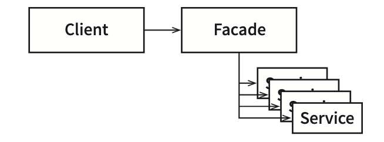

# 05-4부. 아키텍처

# 23장. 프레젠터와 험블 객체
- 험블 객체는 아키텍처 경계를 식별하고 보호하는데 도움이 된다.

## 험블 객체 패턴
- 험블 객체 패턴은 **테스트하기 어려운 행위와 테스트하기 쉬운 행위를 단위 테스트 작성자가 분리하기 쉽게 하는 방법** 으로 고안
### 방법
- 행위들을 두 개의 클래스 or 모듈로 나눈다.  
  - 이들 모듈 중 하나가 험블
- 가장 기본적인 본질은 남기고, 테스트 어려운 행위를 모두 험블 객체로 옮긴다. 
- 나머지 모듈에는 험블에 속하지 않는 테스트하기 쉬운 행위를 모두 옮긴다.

> GUI 경우 단위 테스트가 어려운데 험블 객체패턴을 사용하면 두 부류의 행위를 분리하여 프레젠터와 뷰라는 서로 다른 클래스로 만들 수 있다.

 

## 프레젠터와 뷰
- **뷰는 험블 객체이고 테스트하기 어렵다.**
  - 이곳은 가능한 간단하게 코드 유지
- **프레젠터는 테스트하기 쉬운 객체다.**
  - 프레젠터의 역할은 애플리케이션으로부터 데이터를 받아 화면에 표현할 수 있는 포맷으로 만들어 뷰는 데이터를 화면으로 전달하는 간단한 일만 처리하게함.
> ex) Date 객체를 프레젠테이션에서 적절한 포맷 문자열로 만들고 View model에 담음. 필요하면 boolean타입도 설정 -> view는 view model에서 데이터 찾음
- **뷰는 뷰모델의 데이터를 화면으로 로드할뿐 역할 없다.**

 

## 테스트와 아키텍처
- 좋은 아키텍처는 **테스트 용이성** 을 가져야한다.
- 험블객체 처럼 **테스트 쉬운 부분, 어려운 부분을 분리하면 아키텍처 경계** 가 정의되기 떄문이다.

 

## 데이터베이스 게이트웨이
- 유스케이스 인터랙터와 DB 사이에는 데이터베이스 게이트웨이가 위치한다.
  - 게이트웨이는 다   형성 인터페이스로, 애플리케이션이 DB에 수행하는 CRUD관련 모든 메서드를 포함
  - 구현체는 데이터베이스 계층에 위치하고 험블 객체다.
- **유스케이스는 게이트 인터페이스를 호출** 한다.
  - 유스케이스는 SQL을 허용하지 않는다.
- **인터랙터** 는 애플리리케이션에 특화된 업무 규칙을 캡슐화하기 떄문에 **험블객체가 아니다.**
    - 게이트웨이는 stub이나 test-double로 교체할 수 있어 테스트 쉬움

 

## 데이터 매퍼
- **ORM은 데이터베이스 계층에 위치한다.**
  - 하이버네이트 같은 ORM 같은건 관계형 DB로부터 가져온 데이터를 데이터 구조에 맞게 담아주기 떄문에 사실 '데이터 매퍼'가 적절하다.
  - 사용자입장에서 객체는 오퍼레이션 집합이기 떄문이다. (데이터는 private)
  - 데이터 구조는 함축 행위를 가지지 않는 public 데이터 변수 집합
- ORM은 게이트웨이 인터페이스와 데이터베이스 사이에서 또 다른 험블 객체 경계를 형성 한다.

 

## 서비스 리스너

 

## 결론
- 각 아키텍처 경계마다 숨어있는 험블 객체 패턴을 발견할 수있다.
  - 경계를 넘나드는 통신은 거의 모두 간단한 데이터 구조를 수반할때가 많고, 대개 그 경계는 테스트하기 어려운 무언가와 테스트하기 쉬운 무언가로 분리될것이다.
- 아키텍처 경계에서 험블 객체 패턴을 사용하면 테스트 용이성을 크게 높일 수 있다.

 

# 24장. 부분경계
## 부분적 경계
- 아키텍처 경계를 완벽히 만드는데는 비용이 크다.
  - 쌍방향의 Boundary 인터페이스, 입출력 데이터 구조.. 등
  - 이런 방식은 YAGNI 원칙을 위배하기도..  
  
-> 그렇다면 **부분적 경계** 를 구현해볼 수 있다.

> 여기서 YAGNI 원칙은 쉽게 "필요한 작업만 해"라는 뜻

 

## 마지막 단계를 건너뛰기
- 부분적 경계를 생성하는 방법 하나는 **독립적으로 컴파일하고 배포할 수 있는 컴포넌트를 만들기 위한 작업은 모두 수행** 한 후, **단일 컴포넌트에 그대로 모아만 둔다.**  -> 모두 단일 컴포넌트로 컴파일해서 배포
- 완벽한 경계를 만들때 만큼의 코드량이 필요하지만, **다수의 컴포넌트를 관리하는 작업** 은 안해도된다. (추적을 위한 버전번호, 배포 관리 부담) 

 

## 일차원 경계
  

- 완벽한 형태의 경계는 쌍방향 Boundary인터페이스를 유지하지만 비용이 많이 든다.
- 이때 **전통적인 전략패턴** 을 사용할 수 있다.
  - Client를 ServiceImpl로 부터 격리시키는데 필요한 의존성역전이 적용됨
  - 추후 완벽한 형태의 경계로 확장할 수 있다.
  - 하지만 제대로 사용하지않으면, 위 점선과 같은 비밀 통로가 생길 수 있음. (이해안감..)

 

## 퍼사드

  

- 경계는 Facade 클래스로만 간단히 정의된다. Facade 클래스에는 모든 서비스 클래스를 메서드 형태로 정의하고, 서비스 호출이 발생하면 해당 서비스 클래스로 호출을 전달한다. (클라이언트는 서비스 클래스에 직접 접근 못함)
- 하지만 Client가 추이 종속성 가짐 
  - 서비스 클래스 변경되면 Client도 재컴파일 해야됨
  - 비밀 통로 또한 쉽게 만들어짐
