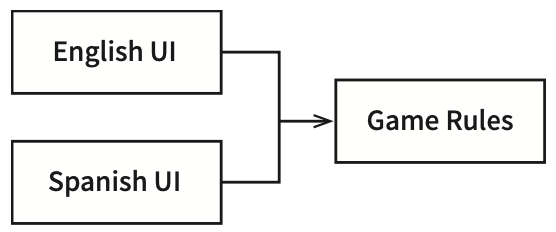
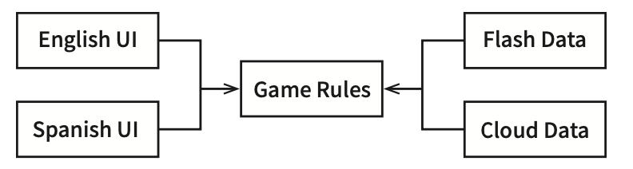
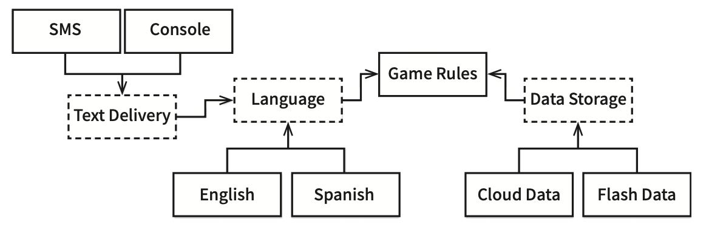
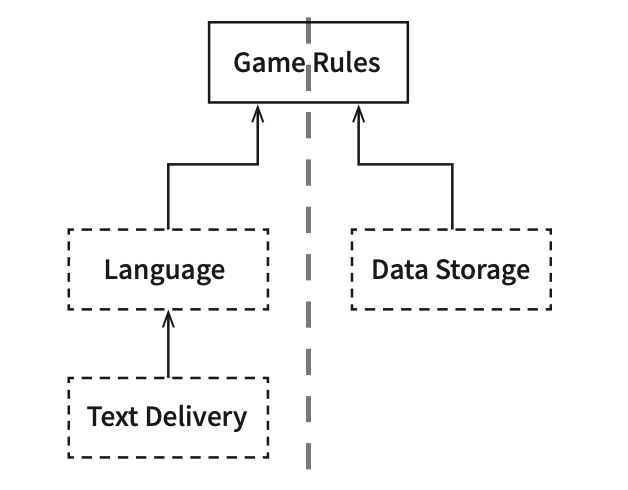
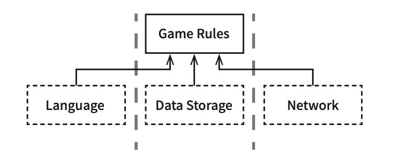
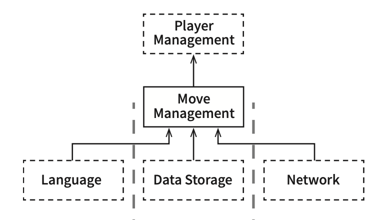

# 05-5부. 아키텍처

# 25장. 계층과 경계 

## 움퍼스 사냥 게임

  
- 소스 코드 의존성을 적절히 관리하면, UI 컴포넌트가 어떤 언어를 사용하더라도 게임 규칙을 재사용할 수 있다.

  

- 게임 규칙이 다양한 종류의 데이터 저장소에 대해 알지 않기 위해서는 의존성 규칙을 준수해야한다.

 

## 클린 아키텍처?
- UI에서 언어도 변경하고 싶을뿐만 아니라, 텍스트를 주고 받는 매커니즘 (ex. shell or 채팅 or 텍스트)을 다양하게 만들고 싶을 수 있다.
- 
  

- 점선으로 된 테두리는 API를 정의하는 추상 컴포넌트를 뜻하고, 각각 컴포넌트들이 이를 구현.
- GameRules는 GameRules가 정의하고 Language가 구현하는 API를 이용해 Language와 통신한다.
  - 마찬가지로 Language도 Language가 정의하고 TextDelivery가 구현하는 API를 이용해 TextDelivery와 통신한다.
  - API는 구현하는 쪽이아닌 사용하는 쪽에 정의되고 소속된다.
- GameRules보면 GameRules 내부 코드에서 사용하고 Language 내부 코드에서 구현하는 다형적 Boundary 인터페이스를 발견할 수 있다.

  

- 모든 경우 해당 Boundary 인터페이스가 정의하는 API는 의존성 흐름의 상위에 위치한 컴포넌트에 속한다.
  - GameRules가 최상위 수준 정책을 가진 컴포넌트 -> 의존성 흐름을 보자
- 데이터 흐름을 두 개의 흐름으로 효과적으로 분리한다.
  - 왼쪽의 흐름은 사용자와의 통신에 관여
  - 오른쪽 흐름은 데이터 영속성에 관여
  두 흐름은 GameRules에서 만나 두 흐름이 모두 거치게 되는 데이터에 대한 최종 처리기가 된다.

 

## 흐름 횡단하기

데이터 흐름은 항상 두가지가 아닌 더 추가될 수 있음.

  

 

## 흐름 분기하기

  
- 고수준 정책은 플레이어를 관리한다. 
- 여기서 MoveManagement와 PlayerManagement를 분리하는 API가 필요할까 ? 

 

## 결론
- 아키텍처 경계가 언제 필요한지를 신중하게 파악해야한다.
- 또한 경계를 구현하려면 비용이 드며, 만약 무시되었다면 다시 추가하는 비용이 크다.
- 비용을 산정하여 어디에 아키텍처를 둬야할지, 완벽하게 구현할 경계는 무엇인지와 부분적으로 구현할 경계와 무시할 경계는 무엇인지를 결정해야한다.

 

# 26장. 메인 컴포넌트

## 궁극적인 세부사항

- 메인 컴포넌트는 궁극적인 세부사항으로, 가장 낮은 수준 정책이다. 
  - 초기 진입점으로, 어떤것도 메인에 의존하지 않음
  - 시스템 전반을 담당하는 기반을 생성 후 더 높은 수준을 담당하는 부분으로 제어권을 넘김
- 입력 스트림 생성, 게임 메인 루프처리, 간단한 입력 명령어 해석은 main함수에서 처리하지만, 명령어를 실제로 처리하는 일은 다른 고수준 컴포넌트로 위임한다.
- **즉 메인은 클린 아키텍처에서 가장 바깥쪽 원에 위치한 저수준 모듈이다. 메인은 고수준의 시스템을 위한 모든 것을 로드한 후, 제어권을 고수준의 시스템에게 넘긴다.**

 

## 결론

- 메인을 애플리케이션의 플러그인이라고 생각하자.
- **메인은 초기 조건과 설정을 구성하고, 외부 자원을 모두 수집한 후, 제어권을 애플리케이션의 고수준 정책으로 넘기는 플러그인**이다.
  

 

# 27장. '크고 작은 모든' 서비스들

## 서비스아키텍처

>- 시스템 **아키텍처는 의존성 규칙을 준수**하며 고수준 정책을 저수준의 세부사항으로 부터 분리하는 경계에 의해 정의.
>- **단순 행위만 분리하는 서비스**는 값비싼 함수 호출에 불과하며, **아키텍처관점에서 중요하다 볼 수 없음**.
>- 물론 도움 될때도 있어서 모든 서비스가 아키텍처 관점에서 중요해야만 하는건아님. 

- **서비스는 결국 프로세스나 플랫폼 경계를 가로지르는 함수 호출**에 지나지 않는다. 
- 아키텍처적으로 중요한 서비스도 있지만, 중요하지 않는 서비스도 있다.  
  이장에서 관심을 가지는 서비스는 **'아키텍처적으로 중요한 서비스'**이다.

 

## 서비스의 이점?

### 결합 분리의 오류

- 시스템을 서비스들로 분리함으로써 예상되는 큰 이점은 서비스 사이의 결합이 확실히 분리된다는 것이다.

- 하지만 **프로세서 내, 네트워크 상의 공유 자원** 혹은 **서로 공유하는 데이터**에 의해 **서비스는 결합될 가능성이 존재**한다.

  > Ex) 서비스 사이 오고가는 데이터 레코드에 새로운 필드를 추가한다면, 이 필드를 사용하는 모든 서비스는 반드시 변경해야되고 사전에 해석하는 방식을 조율해야함. -> 서비스들은 레코드들에 결합 -> 서비스 사이는 간접적으로 결합이 생김

 

### 개발 및 배포 독립성의 오류

- 서비스를 사용하면 또 다른 이점은 **전담팀이 서비스를 소유하고 운영한다는**점이다.

하지만

1. 대규모 엔터프라이즈 시스템은 모노리틱 시스템으로도 구축될 수 있다. 
   서비스는 확장가능한 시스템을 구축하는 유일한 선택지가 아니다.

2. 결합 분리 오류에 따르면 서비스라고 해서 항상 독립적으로 개발, 배포, 운영할 수 있는것은 아니다.

 

## 야옹이 문제

- 요약하자면 새로운 기능을 추가하고자 했으나, **서비스들은 모두 결합되어 있어서 독립적으로 개발, 배포, 유지될 수 없다.** 
- 이것은 **횡단 관심사**가 지닌 문제다. 
  **같은 종류의 기능적 분해는 새로운 기능이 기능적 행위를 횡단하는 상황에 매우 취약**하다.

 

## 객체가 구출하다. 

- **컴포넌트 기반 아키텍처**는 SOLID 설계 원칙으로 다형적으로 확장할 수 있는 클래스 집합을 생성해 새로운 기능을 처리한다.

- 의존성들이 의존성 규칙을 준수한다는것에 주목하자.
- 배차에 특화 로직은 Rides 컴포넌트, 야옹이에 대한 신규 기능은 Kittens 컴포넌트.
  이 두 컴포넌트는 **기존 컴포넌트들에 있는 추상클래스를 템플릿 메서드**나 **전략패턴을 이용해서 오버라이드** 한다.
  또한 의존성 규칙을 준수하며, UI 제어하에 팩토리가 생성한다.
  - 물론 전략을 따르더라도 야옹이 기능을 구현하기 위해서는 UI는 변경이 되지만 그외는 변경될 필요가 없다.
- 따라서 **추가된 기능(야옹이)은 결합이 분리되며, 독립적으로 개발하여 배포**할 수 있다.

 

## 컴포넌트 기반 서비스

서비스에도 위와 같이 할 수 있다.

- **서비스**가 반드시 monolith여야 할 이유가 없고, **SOLID 원칙대로 설계할 수 있고, 컴포넌트 구조를 갖출 수**도 있다.
  이를 통해 **기존 컴포넌트를 변경하지 않고 새로운 컴포넌트를 추가할 수 있다.**

> - 자바의 경우 서비스를 하나 이상의 jar파일에 포함되는 추상 클래스들의 집합이라 생각하자.
> - 새로운 기능 추가는 새로운 jar로 만들며 기존 jar파일의 추상 클래스를 확장해서 만든다. 
> - 그럼 새로운 기능 배포는 서비스를 재배포하는 것이아닌 서비스를 로드하는 경로에 단순히 새로운 jar파일을 추가하는 문제가 된다. -> 개방 폐쇄 원칙을 준수하게된다

 

## 횡단 관심사

- 아키텍처 **경계가 서비스 사이에 있지 않다**. 오히려 **서비스를 관통하며, 서비스를 컴포넌트 단위로 분할**한다.
- **횡단 관심사를 처리하려면 서비스 내부는 의존성 규칙도 준수하는 컴포넌트 아키텍처로 설계**해야한다.

